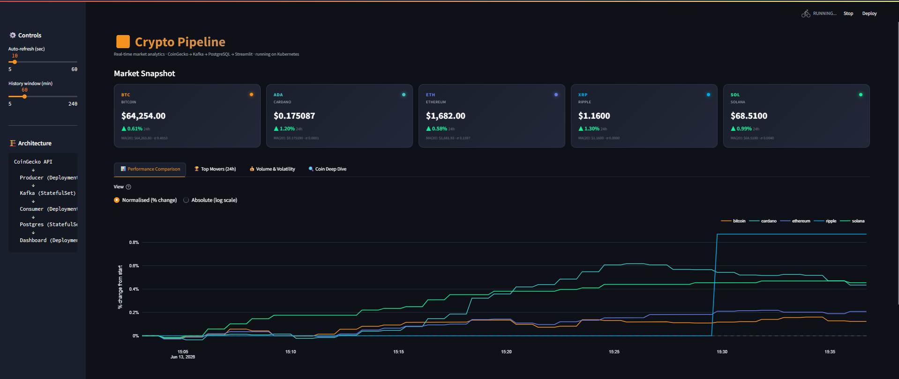
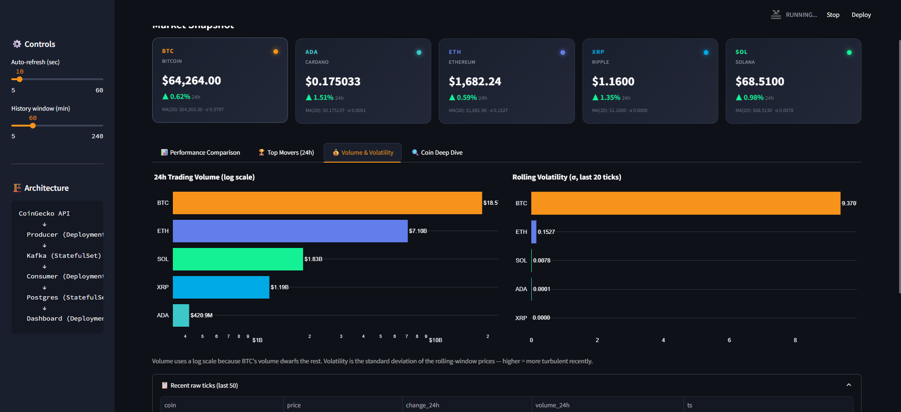
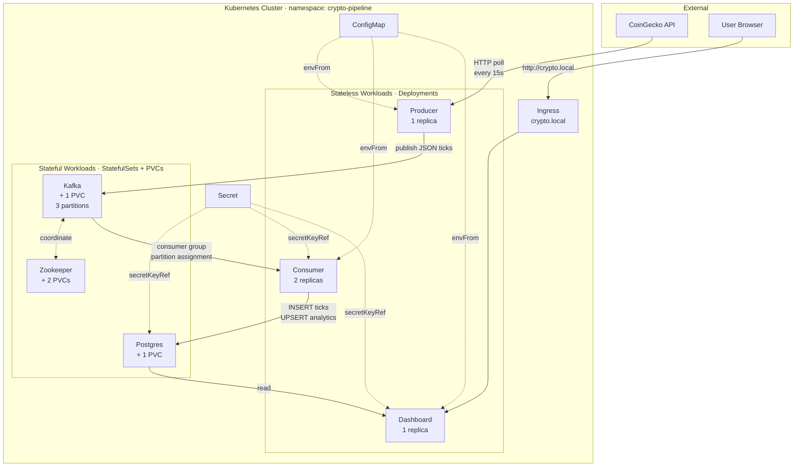

# 📈 Real-Time Crypto Streaming Pipeline on Kubernetes

An end-to-end streaming data pipeline that ingests live cryptocurrency prices, processes them with rolling analytics, and visualises the results on a modern dashboard — all containerised and orchestrated on Kubernetes.

Built as a portfolio project to demonstrate end-to-end data engineering: streaming ingestion, message brokering, stateful processing, persistent storage, and visualisation, deployed on Kubernetes with the production patterns that real platforms use.

PERFORMANCE COMPARISON

VOLUME AND VOLATILITY


---

## Architecture



---

## What it does

The pipeline runs continuously. Every 15 seconds:

1. **Producer** polls the CoinGecko API for live prices of 5 coins (BTC, ETH, SOL, ADA, XRP)
2. **Kafka** receives one JSON message per coin per tick, keyed by coin id
3. **Consumer** (2 replicas) reads from Kafka, persists each tick to Postgres, and updates a rolling-window analytics table with moving average and volatility per coin
4. **Dashboard** reads from Postgres and renders 4 analytical views — % performance comparison, top movers, volume + volatility rankings, and a per-coin deep dive

The whole thing is stateful, horizontally scalable, and self-healing.

---

## Tech Stack

| Layer | Technology |
|---|---|
| Languages | Python 3.12 |
| Containers | Docker |
| Orchestration | Kubernetes (Minikube locally) |
| Streaming | Apache Kafka 7.6 (Confluent image) |
| Coordination | Zookeeper |
| Database | PostgreSQL 16 |
| Dashboard | Streamlit + Plotly |
| Data source | CoinGecko public API |

---

## Kubernetes Concepts Demonstrated

This is the technical core of the project. Each K8s primitive is used because it's the right tool for the job, not for the sake of demonstration.

| Concept | Where it's used | Why this concept here |
|---|---|---|
| **Deployment** | producer, consumer (×2), dashboard | Stateless workers — any replica can replace any other. K8s manages rolling updates, replica counts, and self-healing replacement |
| **StatefulSet** | postgres, kafka, zookeeper | Stateful services need (a) stable network identity so peers can find them after restarts, (b) per-pod persistent volumes that survive pod replacement, and (c) ordered rollout. Postgres can't be a Deployment |
| **Service (Headless)** | postgres, kafka, zookeeper | `clusterIP: None` means DNS resolves to pod IPs directly. Each pod in the StatefulSet gets a stable hostname like `kafka-0.kafka.crypto-pipeline.svc.cluster.local` |
| **Service (ClusterIP)** | dashboard | Virtual-IP service in front of the dashboard pod — what the Ingress points at |
| **Ingress** | `crypto.local` → dashboard | HTTP routing from outside the cluster. In production this would be the public URL |
| **ConfigMap** | `crypto-config` | All non-secret configuration (Kafka bootstrap address, topic name, coin list, polling interval, Postgres DB name, dashboard refresh interval). Pulled into pods via `envFrom` |
| **Secret** | `crypto-secrets` | Postgres credentials, mapped to `POSTGRES_USER`/`POSTGRES_PASSWORD` in the postgres pod and `PG_USER`/`PG_PASSWORD` in the consumer/dashboard pods |
| **PersistentVolumeClaim** | 4 PVCs (postgres ×1, kafka ×1, zookeeper ×2) | Created automatically by each StatefulSet's `volumeClaimTemplates`. Minikube's default storage-provisioner backs them with hostPath |
| **Namespace** | `crypto-pipeline` | Isolates all resources. `kubectl delete ns crypto-pipeline` cleanly tears down the entire app |
| **Readiness Probes** | postgres, kafka, zookeeper, dashboard | Ensures K8s only routes traffic to pods that are actually ready. Critical for stateful services — a "running but unready" pod is invisible via its Service |
| **Liveness Probes** | postgres, dashboard | Restarts pods that have wedged (different from "never started") |
| **Resource Requests/Limits** | every container | Lets the scheduler place pods sensibly and prevents one pod from starving the others |

---

## Demos — the K8s-magic moments

Three live demonstrations of properties that are hard to achieve without an orchestrator. Each was run on the deployed cluster.

### 1. Self-Healing — kill a pod, watch it come back

```powershell
kubectl get pods -n crypto-pipeline -l app=consumer
kubectl delete pod <consumer-pod-name> -n crypto-pipeline
kubectl get pods -n crypto-pipeline -l app=consumer
```

The Deployment's ReplicaSet detects that there's only 1 pod where there should be 2, and creates a replacement within seconds. The new pod automatically rejoins the Kafka consumer group and picks up partitions.

**Why this matters:** Pods die for all kinds of reasons in production — OOM kills, node failures, deploys, network blips. Without an orchestrator, someone gets paged. With K8s, the workload self-recovers and the on-call sleeps through it.

### 2. Horizontal Scaling — one command, more throughput

```powershell
kubectl scale deployment/consumer -n crypto-pipeline --replicas=5
kubectl logs -n crypto-pipeline -l app=consumer --tail=5 --prefix --max-log-requests=5
kubectl scale deployment/consumer -n crypto-pipeline --replicas=2
```

3 new consumer pods spawn, all join the same Kafka consumer group, and Kafka rebalances the 3 topic partitions across the available consumers. The log prefix proves each pod is processing a different subset of coins.

**Why this matters:** When workload doubles, you don't write new code or do a migration. One command, more capacity. The Kafka consumer-group protocol does the partition assignment; K8s does the pod scheduling; no manual coordination required.

### 3. Stateful Persistence — kill the database, data survives

```powershell
kubectl exec -n crypto-pipeline postgres-0 -- \
    psql -U crypto -d crypto -c "SELECT COUNT(*) FROM price_ticks;"
# count → e.g. 12847

kubectl delete pod postgres-0 -n crypto-pipeline
kubectl wait --for=condition=ready pod/postgres-0 -n crypto-pipeline --timeout=120s

kubectl exec -n crypto-pipeline postgres-0 -- \
    psql -U crypto -d crypto -c "SELECT COUNT(*) FROM price_ticks;"
# count → same or higher; all rows survived
```

The Postgres pod terminates and is recreated, but the StatefulSet remounts the same PersistentVolumeClaim. The pod is ephemeral; the data lives on the volume.

**Why this matters:** Making stateless apps resilient on K8s is the easy half. The hard half is stateful workloads — databases, message queues, search indices. StatefulSet + PVC is the answer: stable identity + durable volume, decoupled from any single pod's lifecycle.

---

## Project Structure

```
crypto-k8s-pipeline/
├── README.md                  ← you are here
├── STARTUP.md                 ← daily startup playbook
├── docker-compose.yml         ← Phase 1 — local Docker Compose stack
│
├── producer/                  ← CoinGecko → Kafka
│   ├── producer.py
│   ├── requirements.txt
│   └── Dockerfile
│
├── consumer/                  ← Kafka → Postgres + rolling analytics
│   ├── consumer.py
│   ├── requirements.txt
│   └── Dockerfile
│
├── dashboard/                 ← Streamlit + Plotly UI
│   ├── app.py
│   ├── requirements.txt
│   ├── Dockerfile
│   └── .streamlit/config.toml
│
└── k8s/                       ← Kubernetes manifests (numbered for apply order)
    ├── 00-namespace.yaml
    ├── 01-configmap.yaml
    ├── 02-secret.yaml
    ├── 10-postgres.yaml       ← StatefulSet + headless Service + PVC
    ├── 11-zookeeper.yaml      ← StatefulSet + headless Service + 2 PVCs
    ├── 12-kafka.yaml          ← StatefulSet + headless Service + PVC
    ├── 20-producer.yaml       ← Deployment
    ├── 21-consumer.yaml       ← Deployment (2 replicas)
    ├── 22-dashboard.yaml      ← Deployment + ClusterIP Service
    └── 30-ingress.yaml        ← External HTTP entry point
```

The numeric prefix means `kubectl apply -f k8s/` applies files in dependency order (namespace before config, config before workloads, stateful before stateless).

---

## Quick Start

### Option A — Docker Compose (5 minutes, for fast evaluation)

For inspecting the pipeline logic without touching Kubernetes:

```bash
docker compose up --build
```

Wait ~60 seconds for all services to start, then open <http://localhost:8501>.

### Option B — Kubernetes on Minikube (the real thing)

See [STARTUP.md](STARTUP.md) for the daily playbook. First-time setup:

```powershell
# Start Minikube with enough resources and enable Ingress
minikube start --cpus=4 --memory=6g --disk-size=20g
minikube addons enable ingress

# Build images directly into Minikube's Docker daemon
& minikube docker-env --shell powershell | Invoke-Expression
docker build -t crypto-producer:latest .\producer
docker build -t crypto-consumer:latest .\consumer
docker build -t crypto-dashboard:latest .\dashboard

# Deploy everything
kubectl apply -f k8s/

# Watch the 7 pods come up (takes 2–4 minutes)
kubectl get pods -n crypto-pipeline -w

# Expose the dashboard
kubectl port-forward -n crypto-pipeline service/dashboard 8501:80
```

Open <http://localhost:8501>.

---

## Engineering Decisions Worth Noting

The interesting part of any project isn't what worked on the first try — it's the small decisions and bug-fixes along the way.

### Migrated from `kafka-python` to `kafka-python-ng`
The original `kafka-python` library is abandoned and vendors an outdated `six` module incompatible with Python 3.12 (`ModuleNotFoundError: kafka.vendor.six.moves`). `kafka-python-ng` is a maintained drop-in fork — no code changes required.

### Healthchecks use `cub` instead of `nc`
Confluent's images don't ship with `netcat`, and Zookeeper's default 4-letter-word whitelist excludes `ruok`. Switched to `cub zk-ready` and `cub kafka-ready` (purpose-built readiness utilities bundled in the image).

### Extended K8s probe `timeoutSeconds`
K8s exec probes default to a 1-second timeout, but `cub` makes actual network/protocol calls that can take 5+ seconds. The first deploy had Zookeeper "running but never Ready" — which silently caused the headless service to withhold DNS records, which made Kafka unable to resolve `zookeeper-0.zookeeper.crypto-pipeline.svc.cluster.local`, which made the whole pipeline fail. Set `timeoutSeconds: 10–15` on Zookeeper and Kafka probes to give `cub` room to actually complete.

### `imagePullPolicy: Never` on application pods
Local images built into Minikube's Docker daemon aren't available in any registry. Setting this prevents K8s from trying to pull `crypto-producer:latest` from Docker Hub and failing with `ImagePullBackOff`.

### Dashboard normalises prices to % change by default
BTC at ~$70,000 on the same axis as XRP at ~$0.50 makes XRP look like a flat line at zero. Defaulting the comparison chart to "% change from start of window" makes them directly comparable regardless of absolute price. Added a log-scale toggle for the absolute view.

### 3 Kafka partitions, 2 consumer replicas
Auto-created topics default to 1 partition — which would make horizontal consumer scaling pointless (only one consumer in the group can receive messages). Set `KAFKA_NUM_PARTITIONS: 3` so the consumer Deployment can scale up to 3 replicas with Kafka actually distributing the work.

### Postgres `PGDATA` in a subdirectory
Mounting a fresh PVC at `/var/lib/postgresql/data` causes Postgres to refuse to start (the volume's `lost+found` directory makes it think there's existing-but-unrecognised data). Setting `PGDATA=/var/lib/postgresql/data/pgdata` puts the database files in a clean subdirectory of the volume.

### StatefulSets sometimes need `kubectl delete pod`, not `rollout restart`
When updating a probe spec on a single-replica StatefulSet whose pod is currently unhealthy, `kubectl rollout restart` refuses to proceed — it's waiting for the "old" pod to be Ready before rotating it. Force-deleting the pod (`kubectl delete pod ... --force --grace-period=0`) makes the StatefulSet immediately recreate it using the latest spec.

---

## Future Improvements

A production-grade deployment would add:

- **Helm chart** to template the manifests with values per environment (dev/staging/prod)
- **Prometheus + Grafana** for metrics: Kafka consumer lag, message rates, pod resource usage
- **Kafka in KRaft mode** to drop the Zookeeper dependency entirely (Kafka 3.5+)
- **HorizontalPodAutoscaler** to auto-scale the consumer based on Kafka lag
- **Sealed Secrets or External Secrets Operator** so the Secret manifest can safely live in Git
- **NetworkPolicies** restricting pod-to-pod traffic to only what's needed
- **Multi-broker Kafka** with replication factor > 1 for actual fault tolerance
- **CI/CD** via GitHub Actions + ArgoCD (GitOps)
- **Deploy to a managed cluster** (GKE/EKS) so the dashboard has a public URL

---

## License

MIT
